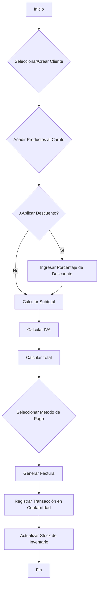
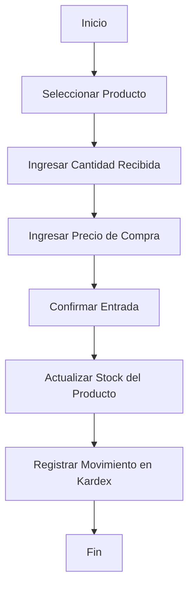

# Documento de Diseño de Negocio: Sistema de Gestión Empresarial

Este documento detalla los objetivos de negocio, el alcance funcional, los casos de uso, las reglas de negocio, los flujos de trabajo y los roles de usuario para el sistema de gestión empresarial.

## 1. Objetivos del Negocio y Alcance Funcional

### 1.1. Objetivos del Negocio

- **Centralizar la Gestión:** Unificar las operaciones de inventario, contabilidad, facturación y ventas en una única plataforma para mejorar la eficiencia y reducir errores.
- **Automatizar Procesos:** Automatizar tareas repetitivas como el cálculo de impuestos, la generación de reportes contables y la actualización de inventario para liberar tiempo del personal.
- **Mejorar la Toma de Desiciones:** Proporcionar datos en tiempo real y reportes detallados que permitan a la gerencia tomar decisiones informadas sobre precios, compras y estrategias de venta.
- **Garantizar la Seguridad y Escalabilidad:** Construir una solución segura, que proteja los datos del negocio y de los clientes, y que pueda crecer junto con la empresa.
- **Ofrecer una Experiencia de Usuario Moderna:** Facilitar la adopción del sistema a través de una interfaz intuitiva, rápida y accesible desde cualquier dispositivo.

### 1.2. Alcance Funcional

El sistema cubrirá las siguientes áreas funcionales:

- **Gestión de Productos:** CRUD (Crear, Leer, Actualizar, Borrar) de productos, incluyendo nombre, descripción, SKU, imágenes y precios (base y de venta).
- **Control de Inventario:** Registro de entradas (compras a proveedores) y salidas (ventas, mermas) de productos. Control de stock en tiempo real.
- **Facturación:** Creación de facturas para clientes, aplicación de descuentos e IVA, y generación de un documento PDF imprimible y/o enviable por correo.
- **Contabilidad Automatizada:** Generación de reportes de cierre de caja (diarios), reportes de ventas mensuales y anuales.
- **Gestión de Precios:** Capacidad para cambiar precios, con un historial de cambios que registre la fecha, el precio anterior y el nuevo precio.
- **Seguridad y Roles:** Sistema de autenticación y autorización basado en roles para controlar el acceso a las diferentes funcionalidades.

### 1.3. Alcance Funcional Contable (Nuevo)

- **Contabilidad de Doble Partida:** Registro de todas las transacciones financieras como asientos contables (débitos y créditos) para garantizar la integridad de los datos.
- **Plan de Cuentas (Chart of Accounts):** Gestión completa del plan de cuentas de la empresa, permitiendo organizar y clasificar las cuentas de Activos, Pasivos, Patrimonio, Ingresos y Egresos.
- **Automatización de Asientos:** Generación automática de asientos contables a partir de operaciones clave como la emisión de una factura de venta o el registro de una compra de inventario.
- **Cierres Contables:** Procesos para realizar cierres contables (diarios, mensuales, anuales) que consolidan las transacciones y preparan los libros para el siguiente período.
- **Generación de Reportes Financieros:** Creación de reportes estándar como el Balance General y el Estado de Resultados para evaluar la salud financiera del negocio.

## 2. Casos de Uso

A continuación, se describen los casos de uso principales para los roles identificados.

### 2.1. Administrador

- **UC-01: Gestionar Productos:** El administrador puede crear, editar y eliminar productos del catálogo. Debe poder asignar imágenes, precios y un SKU único.
- **UC-02: Gestionar Inventario:** El administrador puede registrar entradas de mercancía de proveedores y registrar salidas por motivos distintos a la venta (ej. mermas, donaciones).
- **UC-03: Gestionar Usuarios:** El administrador puede crear, modificar y desactivar cuentas de usuario, así como asignarles roles.
- **UC-04: Consultar Reportes Contables:** El administrador tiene acceso a todos los reportes de ventas, cierres diarios, mensuales y anuales.
- **UC-05: Ajustar Precios:** El administrador puede modificar el precio base y de venta de los productos. El sistema debe guardar un historial de estos cambios.

### 2.2. Gerente de Ventas

- **UC-06: Realizar Facturas:** Puede crear facturas para ventas a clientes, buscando productos del inventario y añadiéndolos a la venta.
- **UC-07: Aplicar Descuentos:** Puede aplicar descuentos globales o por producto en una factura, según las políticas de la empresa.
- **UC-08: Realizar Cierre de Caja:** Al final del día, puede ejecutar el proceso de cierre de caja, que totaliza las ventas y los métodos de pago.

### 2.3. Contador / Auditor (Rol Extendido)

- **UC-09: Gestionar Plan de Cuentas:** El contador puede crear, editar, desactivar y organizar la jerarquía del plan de cuentas contables.
- **UC-10: Registrar Asientos Manuales:** Puede crear asientos contables manuales para registrar transacciones que no se originan en otros módulos, como ajustes, depreciaciones o pagos de nómina.
- **UC-11: Supervisar Asientos Automáticos:** Tiene la capacidad de revisar y verificar la correcta generación de los asientos contables que el sistema crea automáticamente.
- **UC-12: Ejecutar Cierres Contables:** Es responsable de iniciar y supervisar los procesos de cierre mensual y anual, asegurando que todos los registros estén correctos antes de cerrar un período.
- **UC-13: Generar Reportes Financieros:** Puede generar en cualquier momento el Balance General y el Estado de Resultados para un período determinado.

## 3. Reglas de Negocio

- **BR-01:** El stock de un producto no puede ser negativo. El sistema debe impedir ventas de productos sin stock suficiente.
- **BR-02:** Cada producto debe tener un SKU (Stock Keeping Unit) único que no puede ser modificado una vez creado.
- **BR-03:** El IVA se calculará basado en un porcentaje configurable a nivel de sistema (ej. 16%).
- **BR-04:** Todo cambio en el precio de un producto debe ser registrado en el historial de precios.
- **BR-05:** Una factura generada no puede ser modificada. Para corregir un error, se debe emitir una nota de crédito (funcionalidad futura) y crear una nueva factura.
- **BR-06:** Los usuarios solo pueden acceder a las funciones permitidas por su rol asignado.
- **BR-07 (Nueva):** Todo asiento contable debe estar balanceado: la suma total de sus débitos debe ser exactamente igual a la suma total de sus créditos.
- **BR-08 (Nueva):** Una vez que un período contable (ej. un mes) es cerrado, el sistema no permitirá registrar nuevas transacciones ni modificar las existentes en dicho período.
- **BR-09 (Nueva):** Toda factura de venta debe generar un asiento contable automático que, como mínimo, debite Cuentas por Cobrar y acredite Ingresos por Ventas e IVA por Pagar.
- **BR-10 (Nueva):** Toda entrada de inventario por compra debe generar un asiento contable automático que debite la cuenta de Inventario y acredite Cuentas por Pagar.
- **BR-11 (Nueva):** El sistema utilizará el método de **Costo Promedio Ponderado** para la valuación del inventario y el cálculo del costo de los bienes vendidos.
- **BR-12 (Nueva):** En la configuración inicial, el sistema debe precargar un Plan de Cuentas estándar basado en la normativa de Colombia. Este plan podrá ser modificado por usuarios con el rol de "Contador".
- **BR-13 (Nueva):** La automatización de asientos contables (ej. por ventas) utilizará cuentas predeterminadas por el sistema en su arranque inicial. Existirá una pantalla de configuración para que el rol "Contador" pueda reasignar estas operaciones a cuentas específicas de su Plan de Cuentas.

## 4. Flujos de Trabajo Clave

A continuación se presentan diagramas de flujo para los procesos más importantes del sistema.

### 4.1. Flujo de Trabajo: Proceso de Facturación



### 4.2. Flujo de Trabajo: Gestión de Entrada de Inventario



### 4.3. Flujo de Trabajo: Proceso de Cierre Contable Mensual

```mermaid
graph TD
    A[Inicio del Proceso] --> B[Revisar y ajustar asientos manuales del mes];
    B --> C{¿Transacciones del mes correctas?};
    C -- No --> B;
    C -- Sí --> D[Ejecutar proceso de cierre automático];
    D --> E[Sistema valida que todos los asientos estén balanceados];
    E --> F[Sistema calcula saldos finales de todas las cuentas];
    F --> G[Sistema genera asientos de cierre para cuentas de Ingresos y Egresos];
    G --> H[Saldos de cuentas de resultados se transfieren a cuenta de Utilidades Retenidas (Patrimonio)];
    H --> I[Marcar período contable como "Cerrado"];
    I --> J[Generar Balance General y Estado de Resultados del mes];
    J --> K[Fin];
```

## 5. Roles de Usuario y Permisos

| Rol                | Permisos                                                                                                                              |
| ------------------ | ------------------------------------------------------------------------------------------------------------------------------------- |
| **Administrador**  | Acceso total al sistema. CRUD de productos, usuarios, precios, inventario. Acceso a todos los reportes. Configuración del sistema.     |
| **Gerente de Ventas** | Crear facturas, aplicar descuentos, realizar cierres de caja, consultar reportes de ventas del día. No puede modificar productos ni precios. |
| **Contador/Auditor** | Gestión del plan de cuentas, asientos manuales, ejecución de cierres, generación de reportes financieros. Acceso de solo lectura al resto de módulos operativos. | 