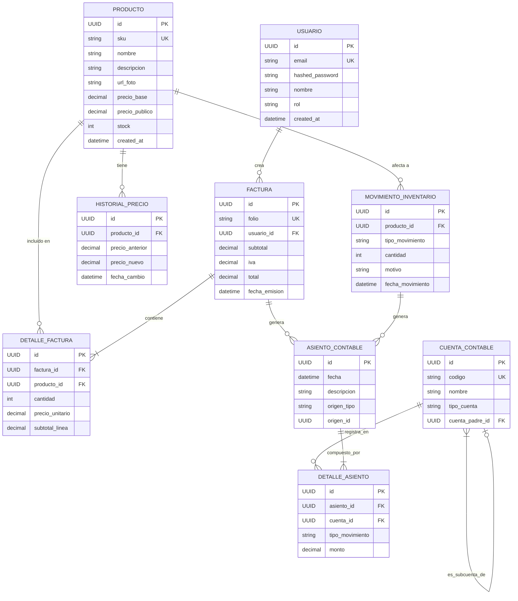

# Modelo de Datos

Este documento describe el modelo de datos para el Sistema de Gestión Empresarial. Incluye un diagrama de Entidad-Relación (ERD) y una descripción detallada de cada una de las entidades (tablas) de la base de datos.

## 1. Modelo Entidad-Relación (ERD)

El siguiente diagrama muestra las entidades principales y las relaciones entre ellas, incluyendo el nuevo módulo de contabilidad.

## 2. Descripción de Entidades

A continuación se detalla cada tabla, sus campos, tipos de datos y restricciones.

### 2.1. `USUARIO`

Almacena la información de los usuarios que pueden acceder al sistema.

| Campo             | Tipo de Dato      | Restricciones / Notas                                |
| ----------------- | ----------------- | ---------------------------------------------------- |
| `id`              | `UUID`            | **PK** - Identificador único primario.               |
| `email`           | `VARCHAR(255)`    | **UK** - Correo electrónico único para el login.     |
| `hashed_password` | `VARCHAR(255)`    | Contraseña hasheada con bcrypt.                      |
| `nombre`          | `VARCHAR(100)`    | Nombre completo del usuario.                         |
| `rol`             | `VARCHAR(50)`     | Rol del usuario (ej. 'administrador', 'vendedor').   |
| `created_at`      | `TIMESTAMP WITH TIME ZONE` | Fecha y hora de creación del registro.      |

### 2.2. `PRODUCTO`

Contiene todos los productos del catálogo de la empresa.

| Campo          | Tipo de Dato      | Restricciones / Notas                                |
| -------------- | ----------------- | ---------------------------------------------------- |
| `id`           | `UUID`            | **PK** - Identificador único primario.               |
| `sku`          | `VARCHAR(50)`     | **UK** - Stock Keeping Unit, código único del producto. |
| `nombre`       | `VARCHAR(255)`    | Nombre del producto.                                 |
| `descripcion`  | `TEXT`            | Descripción detallada del producto.                  |
| `url_foto`     | `VARCHAR(512)`    | URL de la imagen principal del producto.             |
| `precio_base`  | `DECIMAL(10, 2)`  | Costo del producto para el negocio.                  |
| `precio_publico` | `DECIMAL(10, 2)`  | Precio de venta al público (PVP).                    |
| `stock`        | `INTEGER`         | Cantidad actual de unidades en inventario.           |
| `created_at`   | `TIMESTAMP WITH TIME ZONE` | Fecha y hora de creación del registro.      |

### 2.3. `HISTORIAL_PRECIO`

Registra todos los cambios de precio que ha tenido un producto.

| Campo           | Tipo de Dato      | Restricciones / Notas                                |
| --------------- | ----------------- | ---------------------------------------------------- |
| `id`            | `UUID`            | **PK** - Identificador único primario.               |
| `producto_id`   | `UUID`            | **FK** - Referencia a `PRODUCTO.id`.                 |
| `precio_anterior` | `DECIMAL(10, 2)`  | Precio que tenía el producto antes del cambio.       |
| `precio_nuevo`    | `DECIMAL(10, 2)`  | Nuevo precio del producto.                           |
| `fecha_cambio`  | `TIMESTAMP WITH TIME ZONE` | Fecha y hora en que se realizó el cambio.    |

### 2.4. `FACTURA`

Representa una transacción de venta.

| Campo           | Tipo de Dato      | Restricciones / Notas                                |
| --------------- | ----------------- | ---------------------------------------------------- |
| `id`            | `UUID`            | **PK** - Identificador único primario.               |
| `folio`         | `VARCHAR(50)`     | **UK** - Número de folio único para la factura.      |
| `usuario_id`    | `UUID`            | **FK** - Referencia a `USUARIO.id` (el vendedor).    |
| `subtotal`      | `DECIMAL(10, 2)`  | Suma de los precios sin IVA.                         |
| `iva`           | `DECIMAL(10, 2)`  | Monto total de IVA cobrado en la factura.            |
| `total`         | `DECIMAL(10, 2)`  | Monto final a pagar (`subtotal` + `iva`).            |
| `fecha_emision` | `TIMESTAMP WITH TIME ZONE` | Fecha y hora de emisión de la factura.      |

### 2.5. `DETALLE_FACTURA`

Tabla asociativa que detalla los productos incluidos en cada factura.

| Campo             | Tipo de Dato      | Restricciones / Notas                                |
| ----------------- | ----------------- | ---------------------------------------------------- |
| `id`              | `UUID`            | **PK** - Identificador único primario.               |
| `factura_id`      | `UUID`            | **FK** - Referencia a `FACTURA.id`.                  |
| `producto_id`     | `UUID`            | **FK** - Referencia a `PRODUCTO.id`.                 |
| `cantidad`        | `INTEGER`         | Cantidad de unidades vendidas del producto.          |
| `precio_unitario` | `DECIMAL(10, 2)`  | Precio del producto al momento de la venta.          |
| `subtotal_linea`  | `DECIMAL(10, 2)`  | `cantidad` * `precio_unitario`.                      |

### 2.6. `MOVIMIENTO_INVENTARIO`

Registra todas las entradas y salidas de stock, ya sea por ventas, compras, mermas, etc.

| Campo             | Tipo de Dato      | Restricciones / Notas                                |
| ----------------- | ----------------- | ---------------------------------------------------- |
| `id`              | `UUID`            | **PK** - Identificador único primario.               |
| `producto_id`     | `UUID`            | **FK** - Referencia a `PRODUCTO.id`.                 |
| `tipo_movimiento` | `VARCHAR(50)`     | 'ENTRADA', 'SALIDA_VENTA', 'SALIDA_MERMA'.           |
| `cantidad`        | `INTEGER`         | Cantidad de unidades que se mueven (positiva o negativa). |
| `motivo`          | `TEXT`            | Descripción opcional del motivo del movimiento.      |
| `fecha_movimiento`| `TIMESTAMP WITH TIME ZONE` | Fecha y hora en que se registró el movimiento.|

### 2.7. `CUENTA_CONTABLE` (Nueva)

Define el Plan de Cuentas de la empresa, que es la estructura sobre la cual se registran todas las transacciones.

| Campo           | Tipo de Dato      | Restricciones / Notas                                |
| --------------- | ----------------- | ---------------------------------------------------- |
| `id`            | `UUID`            | **PK** - Identificador único primario.               |
| `codigo`        | `VARCHAR(20)`     | **UK** - Código único para la cuenta (ej. "1.1.01").   |
| `nombre`        | `VARCHAR(255)`    | Nombre descriptivo de la cuenta (ej. "Caja General"). |
| `tipo_cuenta`   | `VARCHAR(50)`     | 'ACTIVO', 'PASIVO', 'PATRIMONIO', 'INGRESO', 'EGRESO'. |
| `cuenta_padre_id`| `UUID`           | **FK** - Referencia a `CUENTA_CONTABLE.id` para jerarquía. |

### 2.8. `ASIENTO_CONTABLE` (Nueva)

Representa un único asiento en el libro diario, que es un registro de una transacción financiera.

| Campo         | Tipo de Dato      | Restricciones / Notas                                |
| ------------- | ----------------- | ---------------------------------------------------- |
| `id`          | `UUID`            | **PK** - Identificador único primario.               |
| `fecha`       | `TIMESTAMP WITH TIME ZONE` | Fecha en que ocurrió la transacción.         |
| `descripcion` | `TEXT`            | Descripción del asiento (ej. "Venta según factura F-001"). |
| `origen_tipo` | `VARCHAR(100)`    | Indica la entidad que originó el asiento (ej. 'Factura'). |
| `origen_id`   | `UUID`            | El ID de la entidad de origen (ej. `factura.id`).    |

### 2.9. `DETALLE_ASIENTO` (Nueva)

Cada una de las líneas (partidas) que componen un asiento contable. Un asiento debe tener al menos dos.

| Campo           | Tipo de Dato      | Restricciones / Notas                                |
| --------------- | ----------------- | ---------------------------------------------------- |
| `id`            | `UUID`            | **PK** - Identificador único primario.               |
| `asiento_id`    | `UUID`            | **FK** - Referencia a `ASIENTO_CONTABLE.id`.         |
| `cuenta_id`     | `UUID`            | **FK** - Referencia a `CUENTA_CONTABLE.id`.          |
| `tipo_movimiento`| `VARCHAR(10)`    | 'DEBITO' o 'CREDITO'.                                 |
| `monto`         | `DECIMAL(12, 2)`  | El valor monetario del débito o crédito.             | 